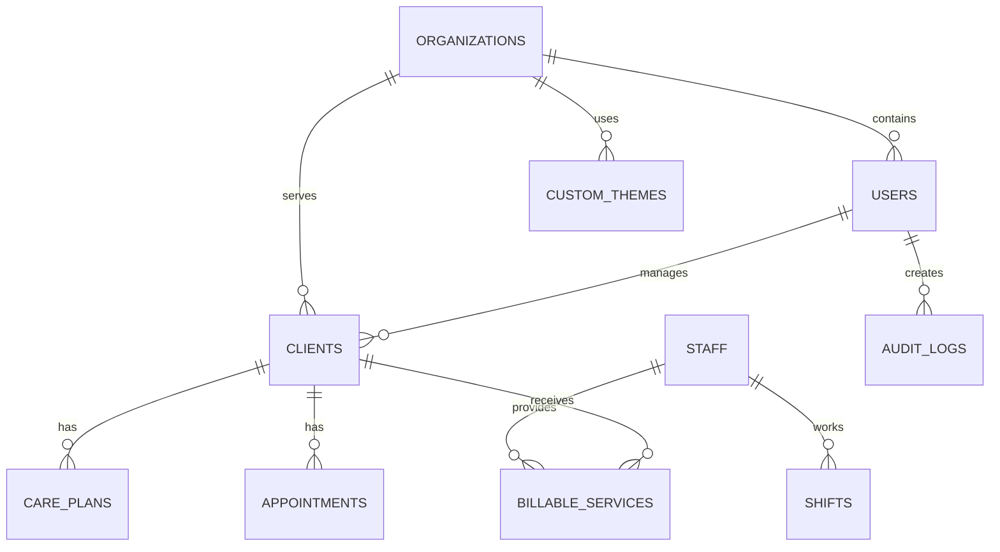

# Starline Backend - Database Schema Documentation

## Table of Contents
1. [Database Design Overview](#database-design-overview)
2. [Core Entity Relationships](#core-entity-relationships)
3. [User Management Tables](#user-management-tables)
4. [Client Management Tables](#client-management-tables)
5. [Staff Management Tables](#staff-management-tables)
6. [Scheduling Tables](#scheduling-tables)
7. [Forms & Documentation Tables](#forms--documentation-tables)
8. [Billing & Financial Tables](#billing--financial-tables)
9. [Reporting & Analytics Tables](#reporting--analytics-tables)
10. [Compliance & Audit Tables](#compliance--audit-tables)
11. [Communication Tables](#communication-tables)
12. [White Labeling Tables](#white-labeling-tables)
13. [File Management Tables](#file-management-tables)
14. [Indexes and Performance](#indexes-and-performance)

## Database Design Overview

### Database Technology
- **Primary Database**: PostgreSQL 15+
- **Cache Layer**: Redis 7+ for session and application caching
- **File Storage**: AWS S3 with CloudFront CDN
- **Search Engine**: PostgreSQL full-text search with potential Elasticsearch integration

### Design Principles
- **Multi-tenant Architecture**: Complete data isolation by organization_id
- **HIPAA Compliance**: Encrypted PHI fields and audit trails
- **Scalability**: Read replicas and horizontal partitioning support
- **Performance**: Optimized indexes and query patterns
- **Consistency**: ACID transactions with foreign key constraints

## Core Entity Relationships



## User Management Tables

### organizations
```sql
CREATE TABLE organizations (
    id                  UUID PRIMARY KEY DEFAULT gen_random_uuid(),
    name                VARCHAR(255) NOT NULL,
    subdomain           VARCHAR(100) UNIQUE NOT NULL,
    custom_domain       VARCHAR(255),
    logo_url            TEXT,
    favicon_url         TEXT,
    primary_color       VARCHAR(7) DEFAULT '#2563eb',
    secondary_color     VARCHAR(7) DEFAULT '#64748b',
    font_family         VARCHAR(100) DEFAULT 'Inter',
    contact_email       VARCHAR(255) NOT NULL,
    contact_phone       VARCHAR(20),
    address             TEXT,
    timezone            VARCHAR(50) DEFAULT 'UTC',
    settings            JSONB DEFAULT '{}',
    feature_flags       JSONB DEFAULT '{}',
    billing_settings    JSONB DEFAULT '{}',
    is_active           BOOLEAN DEFAULT true,
    created_at          TIMESTAMP DEFAULT CURRENT_TIMESTAMP,
    updated_at          TIMESTAMP DEFAULT CURRENT_TIMESTAMP
);
```

### users
```sql
CREATE TABLE users (
    id                      UUID PRIMARY KEY DEFAULT gen_random_uuid(),
    organization_id         UUID NOT NULL REFERENCES organizations(id),
    email                   VARCHAR(255) UNIQUE NOT NULL,
    username                VARCHAR(100) UNIQUE,
    password_hash           VARCHAR(255) NOT NULL,
    first_name              VARCHAR(100) NOT NULL,
    last_name               VARCHAR(100) NOT NULL,
    phone                   VARCHAR(20),
    profile_picture_url     TEXT,
    role_id                 UUID REFERENCES roles(id),
    employee_id             VARCHAR(50),
    hire_date               DATE,
    status                  user_status DEFAULT 'active',
    last_login              TIMESTAMP,
    password_reset_token    VARCHAR(255),
    password_reset_expires  TIMESTAMP,
    email_verified          BOOLEAN DEFAULT false,
    email_verification_token VARCHAR(255),
    two_factor_enabled      BOOLEAN DEFAULT false,
    two_factor_secret       VARCHAR(255),
    created_at              TIMESTAMP DEFAULT CURRENT_TIMESTAMP,
    updated_at              TIMESTAMP DEFAULT CURRENT_TIMESTAMP
);

CREATE TYPE user_status AS ENUM ('active', 'inactive', 'suspended', 'pending');
```

### roles
```sql
CREATE TABLE roles (
    id                  UUID PRIMARY KEY DEFAULT gen_random_uuid(),
    organization_id     UUID NOT NULL REFERENCES organizations(id),
    name                VARCHAR(100) NOT NULL,
    description         TEXT,
    is_system_role      BOOLEAN DEFAULT false,
    created_at          TIMESTAMP DEFAULT CURRENT_TIMESTAMP,
    updated_at          TIMESTAMP DEFAULT CURRENT_TIMESTAMP
);
```

### permissions
```sql
CREATE TABLE permissions (
    id          UUID PRIMARY KEY DEFAULT gen_random_uuid(),
    resource    VARCHAR(100) NOT NULL,
    action      VARCHAR(50) NOT NULL,
    description TEXT,
    created_at  TIMESTAMP DEFAULT CURRENT_TIMESTAMP
);
```

### role_permissions
```sql
CREATE TABLE role_permissions (
    role_id         UUID REFERENCES roles(id) ON DELETE CASCADE,
    permission_id   UUID REFERENCES permissions(id) ON DELETE CASCADE,
    created_at      TIMESTAMP DEFAULT CURRENT_TIMESTAMP,
    PRIMARY KEY (role_id, permission_id)
);
```

### user_sessions
```sql
CREATE TABLE user_sessions (
    id              UUID PRIMARY KEY DEFAULT gen_random_uuid(),
    user_id         UUID NOT NULL REFERENCES users(id) ON DELETE CASCADE,
    token           VARCHAR(500) UNIQUE NOT NULL,
    refresh_token   VARCHAR(500) UNIQUE NOT NULL,
    ip_address      VARCHAR(45),
    user_agent      TEXT,
    expires_at      TIMESTAMP NOT NULL,
    created_at      TIMESTAMP DEFAULT CURRENT_TIMESTAMP,
    revoked_at      TIMESTAMP
);
```

## Client Management Tables

### clients
```sql
CREATE TABLE clients (
    id                      UUID PRIMARY KEY DEFAULT gen_random_uuid(),
    organization_id         UUID NOT NULL REFERENCES organizations(id),
    client_id               VARCHAR(50) UNIQUE NOT NULL,
    first_name              VARCHAR(100) NOT NULL,
    last_name               VARCHAR(100) NOT NULL,
    middle_name             VARCHAR(100),
    preferred_name          VARCHAR(100),
    date_of_birth           DATE NOT NULL,
    gender                  client_gender,
    ssn_encrypted           VARCHAR(255),
    photo_url               TEXT,
    status                  client_status DEFAULT 'active',
    admission_date          DATE,
    discharge_date          DATE,
    primary_diagnosis       TEXT,
    secondary_diagnoses     JSONB DEFAULT '[]',
    allergies               JSONB DEFAULT '[]',
    dietary_restrictions    JSONB DEFAULT '[]',
    created_at              TIMESTAMP DEFAULT CURRENT_TIMESTAMP,
    updated_at              TIMESTAMP DEFAULT CURRENT_TIMESTAMP,
    created_by              UUID REFERENCES users(id)
);

CREATE TYPE client_gender AS ENUM ('male', 'female', 'other', 'prefer_not_to_say');
CREATE TYPE client_status AS ENUM ('active', 'inactive', 'discharged', 'deceased', 'on_hold');
```

### client_contacts
```sql
CREATE TABLE client_contacts (
    id                  UUID PRIMARY KEY DEFAULT gen_random_uuid(),
    client_id           UUID NOT NULL REFERENCES clients(id) ON DELETE CASCADE,
    contact_type        contact_type NOT NULL,
    first_name          VARCHAR(100) NOT NULL,
    last_name           VARCHAR(100) NOT NULL,
    relationship        VARCHAR(100),
    phone_primary       VARCHAR(20),
    phone_secondary     VARCHAR(20),
    email               VARCHAR(255),
    address             TEXT,
    is_primary          BOOLEAN DEFAULT false,
    can_make_decisions  BOOLEAN DEFAULT false,
    notes               TEXT,
    created_at          TIMESTAMP DEFAULT CURRENT_TIMESTAMP,
    updated_at          TIMESTAMP DEFAULT CURRENT_TIMESTAMP
);

CREATE TYPE contact_type AS ENUM ('emergency', 'primary', 'guardian', 'power_of_attorney', 'physician', 'case_manager');
```

### client_locations
```sql
CREATE TABLE client_locations (
    id                  UUID PRIMARY KEY DEFAULT gen_random_uuid(),
    organization_id     UUID NOT NULL REFERENCES organizations(id),
    name                VARCHAR(255) NOT NULL,
    address             TEXT,
    city                VARCHAR(100),
    state               VARCHAR(50),
    zip_code            VARCHAR(20),
    phone               VARCHAR(20),
    type                location_type,
    capacity            INTEGER,
    current_occupancy   INTEGER DEFAULT 0,
    manager_id          UUID REFERENCES users(id),
    is_active           BOOLEAN DEFAULT true,
    created_at          TIMESTAMP DEFAULT CURRENT_TIMESTAMP,
    updated_at          TIMESTAMP DEFAULT CURRENT_TIMESTAMP
);

CREATE TYPE location_type AS ENUM ('residential', 'day_program', 'workshop', 'community');
```

### care_plans
```sql
CREATE TABLE care_plans (
    id                  UUID PRIMARY KEY DEFAULT gen_random_uuid(),
    client_id           UUID NOT NULL REFERENCES clients(id) ON DELETE CASCADE,
    plan_type           care_plan_type NOT NULL,
    title               VARCHAR(255) NOT NULL,
    start_date          DATE NOT NULL,
    end_date            DATE,
    review_date         DATE,
    status              plan_status DEFAULT 'draft',
    goals               JSONB DEFAULT '[]',
    interventions       JSONB DEFAULT '[]',
    responsible_staff   UUID[],
    created_by          UUID REFERENCES users(id),
    approved_by         UUID REFERENCES users(id),
    approved_date       TIMESTAMP,
    document_url        TEXT,
    created_at          TIMESTAMP DEFAULT CURRENT_TIMESTAMP,
    updated_at          TIMESTAMP DEFAULT CURRENT_TIMESTAMP
);

CREATE TYPE care_plan_type AS ENUM ('ISP', 'behavior', 'medical', 'dietary', 'therapy');
CREATE TYPE plan_status AS ENUM ('draft', 'active', 'under_review', 'expired', 'archived');
```

## Staff Management Tables

### staff
```sql
CREATE TABLE staff (
    id                  UUID PRIMARY KEY DEFAULT gen_random_uuid(),
    organization_id     UUID NOT NULL REFERENCES organizations(id),
    employee_id         VARCHAR(50) UNIQUE NOT NULL,
    first_name          VARCHAR(100) NOT NULL,
    last_name           VARCHAR(100) NOT NULL,
    middle_name         VARCHAR(100),
    preferred_name      VARCHAR(100),
    email               VARCHAR(255) UNIQUE NOT NULL,
    phone               VARCHAR(20),
    mobile_phone        VARCHAR(20),
    date_of_birth       DATE,
    ssn_encrypted       VARCHAR(255),
    address             TEXT,
    city                VARCHAR(100),
    state               VARCHAR(50),
    zip_code            VARCHAR(20),
    hire_date           DATE NOT NULL,
    termination_date    DATE,
    employment_status   employment_status DEFAULT 'active',
    department          VARCHAR(100),
    job_title           VARCHAR(100),
    supervisor_id       UUID REFERENCES staff(id),
    hourly_rate         DECIMAL(10,2),
    salary              DECIMAL(12,2),
    pay_type            pay_type,
    fte_percentage      DECIMAL(5,2) DEFAULT 100.00,
    profile_picture_url TEXT,
    notes               TEXT,
    created_at          TIMESTAMP DEFAULT CURRENT_TIMESTAMP,
    updated_at          TIMESTAMP DEFAULT CURRENT_TIMESTAMP,
    created_by          UUID REFERENCES users(id)
);

CREATE TYPE employment_status AS ENUM ('active', 'inactive', 'terminated', 'on_leave', 'suspended');
CREATE TYPE pay_type AS ENUM ('hourly', 'salary', 'contract');
```

### staff_certifications
```sql
CREATE TABLE staff_certifications (
    id                      UUID PRIMARY KEY DEFAULT gen_random_uuid(),
    staff_id                UUID NOT NULL REFERENCES staff(id) ON DELETE CASCADE,
    certification_type      VARCHAR(255) NOT NULL,
    certification_name      VARCHAR(255) NOT NULL,
    issuing_organization    VARCHAR(255) NOT NULL,
    certification_number    VARCHAR(100),
    issue_date              DATE NOT NULL,
    expiry_date             DATE,
    renewal_required        BOOLEAN DEFAULT true,
    renewal_period_months   INTEGER,
    status                  cert_status DEFAULT 'active',
    document_url            TEXT,
    verification_url        TEXT,
    reminder_days_before    INTEGER DEFAULT 30,
    created_at              TIMESTAMP DEFAULT CURRENT_TIMESTAMP,
    updated_at              TIMESTAMP DEFAULT CURRENT_TIMESTAMP
);

CREATE TYPE cert_status AS ENUM ('active', 'expired', 'pending_renewal', 'suspended');
```

### training_programs
```sql
CREATE TABLE training_programs (
    id                  UUID PRIMARY KEY DEFAULT gen_random_uuid(),
    organization_id     UUID NOT NULL REFERENCES organizations(id),
    program_name        VARCHAR(255) NOT NULL,
    description         TEXT,
    category            VARCHAR(100),
    is_mandatory        BOOLEAN DEFAULT false,
    frequency_months    INTEGER,
    duration_hours      DECIMAL(5,2),
    delivery_method     delivery_method,
    prerequisites       JSONB DEFAULT '[]',
    materials_url       TEXT,
    test_required       BOOLEAN DEFAULT false,
    passing_score       DECIMAL(5,2),
    is_active           BOOLEAN DEFAULT true,
    created_at          TIMESTAMP DEFAULT CURRENT_TIMESTAMP,
    updated_at          TIMESTAMP DEFAULT CURRENT_TIMESTAMP
);

CREATE TYPE delivery_method AS ENUM ('online', 'classroom', 'on_job', 'blended');
```

## Scheduling Tables

### schedules
```sql
CREATE TABLE schedules (
    id                  UUID PRIMARY KEY DEFAULT gen_random_uuid(),
    organization_id     UUID NOT NULL REFERENCES organizations(id),
    schedule_name       VARCHAR(255) NOT NULL,
    schedule_type       schedule_type,
    start_date          DATE NOT NULL,
    end_date            DATE NOT NULL,
    status              schedule_status DEFAULT 'draft',
    created_by          UUID REFERENCES users(id),
    approved_by         UUID REFERENCES users(id),
    approved_at         TIMESTAMP,
    notes               TEXT,
    created_at          TIMESTAMP DEFAULT CURRENT_TIMESTAMP,
    updated_at          TIMESTAMP DEFAULT CURRENT_TIMESTAMP
);

CREATE TYPE schedule_type AS ENUM ('weekly', 'monthly', 'custom');
CREATE TYPE schedule_status AS ENUM ('draft', 'published', 'locked', 'archived');
```

### shifts
```sql
CREATE TABLE shifts (
    id              UUID PRIMARY KEY DEFAULT gen_random_uuid(),
    schedule_id     UUID REFERENCES schedules(id),
    staff_id        UUID REFERENCES staff(id),
    location_id     UUID REFERENCES client_locations(id),
    shift_date      DATE NOT NULL,
    start_time      TIME NOT NULL,
    end_time        TIME NOT NULL,
    break_start     TIME,
    break_end       TIME,
    meal_start      TIME,
    meal_end        TIME,
    status          shift_status DEFAULT 'scheduled',
    shift_type      shift_type DEFAULT 'regular',
    is_mandatory    BOOLEAN DEFAULT false,
    notes           TEXT,
    created_at      TIMESTAMP DEFAULT CURRENT_TIMESTAMP,
    updated_at      TIMESTAMP DEFAULT CURRENT_TIMESTAMP
);

CREATE TYPE shift_status AS ENUM ('scheduled', 'confirmed', 'in_progress', 'completed', 'cancelled', 'no_show');
CREATE TYPE shift_type AS ENUM ('regular', 'overtime', 'holiday', 'on_call', 'split');
```

### appointments
```sql
CREATE TABLE appointments (
    id                  UUID PRIMARY KEY DEFAULT gen_random_uuid(),
    organization_id     UUID NOT NULL REFERENCES organizations(id),
    client_id           UUID NOT NULL REFERENCES clients(id),
    staff_id            UUID REFERENCES staff(id),
    appointment_type    appointment_type,
    title               VARCHAR(255) NOT NULL,
    description         TEXT,
    location            TEXT,
    start_datetime      TIMESTAMP NOT NULL,
    end_datetime        TIMESTAMP NOT NULL,
    status              appointment_status DEFAULT 'scheduled',
    requires_transport  BOOLEAN DEFAULT false,
    transport_staff_id  UUID REFERENCES staff(id),
    reminder_sent       BOOLEAN DEFAULT false,
    notes               TEXT,
    created_at          TIMESTAMP DEFAULT CURRENT_TIMESTAMP,
    updated_at          TIMESTAMP DEFAULT CURRENT_TIMESTAMP
);

CREATE TYPE appointment_type AS ENUM ('medical', 'therapy', 'social', 'legal', 'family_visit', 'outing');
CREATE TYPE appointment_status AS ENUM ('scheduled', 'confirmed', 'in_progress', 'completed', 'cancelled', 'no_show');
```

## Forms & Documentation Tables

### form_templates
```sql
CREATE TABLE form_templates (
    id                  UUID PRIMARY KEY DEFAULT gen_random_uuid(),
    organization_id     UUID NOT NULL REFERENCES organizations(id),
    template_name       VARCHAR(255) NOT NULL,
    category            VARCHAR(100),
    form_structure      JSONB NOT NULL,
    is_active           BOOLEAN DEFAULT true,
    version             INTEGER DEFAULT 1,
    created_at          TIMESTAMP DEFAULT CURRENT_TIMESTAMP,
    updated_at          TIMESTAMP DEFAULT CURRENT_TIMESTAMP
);
```

### form_submissions
```sql
CREATE TABLE form_submissions (
    id                  UUID PRIMARY KEY DEFAULT gen_random_uuid(),
    form_template_id    UUID NOT NULL REFERENCES form_templates(id),
    client_id           UUID REFERENCES clients(id),
    staff_id            UUID NOT NULL REFERENCES users(id),
    submission_data     JSONB NOT NULL,
    status              submission_status DEFAULT 'draft',
    submitted_at        TIMESTAMP,
    approved_by         UUID REFERENCES users(id),
    approved_at         TIMESTAMP,
    created_at          TIMESTAMP DEFAULT CURRENT_TIMESTAMP,
    updated_at          TIMESTAMP DEFAULT CURRENT_TIMESTAMP
);

CREATE TYPE submission_status AS ENUM ('draft', 'submitted', 'approved', 'rejected');
```

### electronic_signatures
```sql
CREATE TABLE electronic_signatures (
    id                      UUID PRIMARY KEY DEFAULT gen_random_uuid(),
    form_submission_id      UUID REFERENCES form_submissions(id),
    signer_id               UUID NOT NULL REFERENCES users(id),
    signer_role             VARCHAR(100),
    signature_data          TEXT NOT NULL,
    signed_at               TIMESTAMP DEFAULT CURRENT_TIMESTAMP,
    ip_address              VARCHAR(45),
    user_agent              TEXT
);
```

## Billing & Financial Tables

### services
```sql
CREATE TABLE services (
    id                  UUID PRIMARY KEY DEFAULT gen_random_uuid(),
    organization_id     UUID NOT NULL REFERENCES organizations(id),
    service_code        VARCHAR(50) NOT NULL,
    service_name        VARCHAR(255) NOT NULL,
    description         TEXT,
    unit_type           unit_type,
    base_rate           DECIMAL(10,2),
    is_active           BOOLEAN DEFAULT true,
    created_at          TIMESTAMP DEFAULT CURRENT_TIMESTAMP,
    updated_at          TIMESTAMP DEFAULT CURRENT_TIMESTAMP
);

CREATE TYPE unit_type AS ENUM ('hour', 'day', 'visit', 'unit');
```

### billable_services
```sql
CREATE TABLE billable_services (
    id                  UUID PRIMARY KEY DEFAULT gen_random_uuid(),
    client_id           UUID NOT NULL REFERENCES clients(id),
    staff_id            UUID NOT NULL REFERENCES staff(id),
    service_id          UUID NOT NULL REFERENCES services(id),
    authorization_id    UUID REFERENCES service_authorizations(id),
    service_date        DATE NOT NULL,
    start_time          TIME,
    end_time            TIME,
    units               DECIMAL(8,2) NOT NULL,
    rate                DECIMAL(10,2) NOT NULL,
    total_amount        DECIMAL(12,2) NOT NULL,
    notes               TEXT,
    created_at          TIMESTAMP DEFAULT CURRENT_TIMESTAMP,
    updated_at          TIMESTAMP DEFAULT CURRENT_TIMESTAMP
);
```

### claims
```sql
CREATE TABLE claims (
    id                  UUID PRIMARY KEY DEFAULT gen_random_uuid(),
    organization_id     UUID NOT NULL REFERENCES organizations(id),
    payer_id            UUID REFERENCES payers(id),
    claim_number        VARCHAR(100) UNIQUE,
    claim_type          claim_type DEFAULT 'initial',
    total_amount        DECIMAL(12,2) NOT NULL,
    status              claim_status DEFAULT 'draft',
    submitted_date      DATE,
    processed_date      DATE,
    payment_date        DATE,
    created_at          TIMESTAMP DEFAULT CURRENT_TIMESTAMP,
    updated_at          TIMESTAMP DEFAULT CURRENT_TIMESTAMP
);

CREATE TYPE claim_type AS ENUM ('initial', 'replacement', 'void');
CREATE TYPE claim_status AS ENUM ('draft', 'submitted', 'processed', 'paid', 'denied', 'rejected');
```

## File Management Tables

### files
```sql
CREATE TABLE files (
    id                  UUID PRIMARY KEY DEFAULT gen_random_uuid(),
    organization_id     UUID NOT NULL REFERENCES organizations(id),
    original_filename   VARCHAR(255) NOT NULL,
    stored_filename     VARCHAR(255) NOT NULL,
    file_path           TEXT NOT NULL,
    file_size           BIGINT NOT NULL,
    mime_type           VARCHAR(100) NOT NULL,
    file_hash           VARCHAR(255) NOT NULL,
    storage_provider    VARCHAR(50) DEFAULT 'aws_s3',
    is_encrypted        BOOLEAN DEFAULT true,
    uploaded_by         UUID NOT NULL REFERENCES users(id),
    uploaded_at         TIMESTAMP DEFAULT CURRENT_TIMESTAMP,
    created_at          TIMESTAMP DEFAULT CURRENT_TIMESTAMP
);
```

### file_permissions
```sql
CREATE TABLE file_permissions (
    id                  UUID PRIMARY KEY DEFAULT gen_random_uuid(),
    file_id             UUID NOT NULL REFERENCES files(id) ON DELETE CASCADE,
    user_id             UUID REFERENCES users(id),
    role_id             UUID REFERENCES roles(id),
    permission_type     file_permission_type NOT NULL,
    granted_by          UUID NOT NULL REFERENCES users(id),
    granted_at          TIMESTAMP DEFAULT CURRENT_TIMESTAMP
);

CREATE TYPE file_permission_type AS ENUM ('read', 'write', 'delete', 'share');
```

## Compliance & Audit Tables

### audit_logs
```sql
CREATE TABLE audit_logs (
    id                  UUID PRIMARY KEY DEFAULT gen_random_uuid(),
    organization_id     UUID NOT NULL REFERENCES organizations(id),
    user_id             UUID REFERENCES users(id),
    action              VARCHAR(100) NOT NULL,
    resource_type       VARCHAR(100) NOT NULL,
    resource_id         UUID,
    old_values          JSONB,
    new_values          JSONB,
    ip_address          VARCHAR(45),
    user_agent          TEXT,
    timestamp           TIMESTAMP DEFAULT CURRENT_TIMESTAMP
);
```

### compliance_rules
```sql
CREATE TABLE compliance_rules (
    id                  UUID PRIMARY KEY DEFAULT gen_random_uuid(),
    organization_id     UUID NOT NULL REFERENCES organizations(id),
    rule_name           VARCHAR(255) NOT NULL,
    rule_type           VARCHAR(100) NOT NULL,
    rule_definition     JSONB NOT NULL,
    severity            severity_level DEFAULT 'medium',
    is_active           BOOLEAN DEFAULT true,
    created_at          TIMESTAMP DEFAULT CURRENT_TIMESTAMP,
    updated_at          TIMESTAMP DEFAULT CURRENT_TIMESTAMP
);

CREATE TYPE severity_level AS ENUM ('low', 'medium', 'high', 'critical');
```

## Communication Tables

### notifications
```sql
CREATE TABLE notifications (
    id                  UUID PRIMARY KEY DEFAULT gen_random_uuid(),
    organization_id     UUID NOT NULL REFERENCES organizations(id),
    user_id             UUID NOT NULL REFERENCES users(id),
    notification_type   VARCHAR(100) NOT NULL,
    title               VARCHAR(255) NOT NULL,
    message             TEXT NOT NULL,
    priority            notification_priority DEFAULT 'normal',
    channels            VARCHAR(50)[] DEFAULT ARRAY['in_app'],
    status              notification_status DEFAULT 'pending',
    sent_at             TIMESTAMP,
    read_at             TIMESTAMP,
    created_at          TIMESTAMP DEFAULT CURRENT_TIMESTAMP
);

CREATE TYPE notification_priority AS ENUM ('low', 'normal', 'high', 'urgent');
CREATE TYPE notification_status AS ENUM ('pending', 'sent', 'delivered', 'failed', 'read');
```

### notification_templates
```sql
CREATE TABLE notification_templates (
    id                  UUID PRIMARY KEY DEFAULT gen_random_uuid(),
    organization_id     UUID NOT NULL REFERENCES organizations(id),
    template_name       VARCHAR(255) NOT NULL,
    template_type       template_type,
    subject             VARCHAR(255),
    body                TEXT NOT NULL,
    variables           JSONB DEFAULT '[]',
    is_active           BOOLEAN DEFAULT true,
    created_at          TIMESTAMP DEFAULT CURRENT_TIMESTAMP,
    updated_at          TIMESTAMP DEFAULT CURRENT_TIMESTAMP
);

CREATE TYPE template_type AS ENUM ('email', 'sms', 'push', 'in_app');
```

## White Labeling Tables

### custom_themes
```sql
CREATE TABLE custom_themes (
    id                  UUID PRIMARY KEY DEFAULT gen_random_uuid(),
    organization_id     UUID NOT NULL REFERENCES organizations(id),
    theme_name          VARCHAR(255) NOT NULL,
    css_variables       JSONB DEFAULT '{}',
    custom_css          TEXT,
    is_active           BOOLEAN DEFAULT false,
    created_at          TIMESTAMP DEFAULT CURRENT_TIMESTAMP,
    updated_at          TIMESTAMP DEFAULT CURRENT_TIMESTAMP
);
```

### org_email_templates
```sql
CREATE TABLE org_email_templates (
    id                  UUID PRIMARY KEY DEFAULT gen_random_uuid(),
    organization_id     UUID NOT NULL REFERENCES organizations(id),
    template_type       VARCHAR(100) NOT NULL,
    subject             VARCHAR(255) NOT NULL,
    html_content        TEXT NOT NULL,
    text_content        TEXT,
    variables           JSONB DEFAULT '[]',
    is_active           BOOLEAN DEFAULT true,
    created_at          TIMESTAMP DEFAULT CURRENT_TIMESTAMP,
    updated_at          TIMESTAMP DEFAULT CURRENT_TIMESTAMP
);
```

## Indexes and Performance

### Primary Indexes
```sql
-- User Management
CREATE INDEX idx_users_organization_id ON users(organization_id);
CREATE INDEX idx_users_email ON users(email);
CREATE INDEX idx_user_sessions_token ON user_sessions(token);
CREATE INDEX idx_user_sessions_user_id ON user_sessions(user_id);

-- Client Management
CREATE INDEX idx_clients_organization_id ON clients(organization_id);
CREATE INDEX idx_clients_status ON clients(status);
CREATE INDEX idx_client_contacts_client_id ON client_contacts(client_id);

-- Staff Management
CREATE INDEX idx_staff_organization_id ON staff(organization_id);
CREATE INDEX idx_staff_employment_status ON staff(employment_status);
CREATE INDEX idx_staff_certifications_staff_id ON staff_certifications(staff_id);
CREATE INDEX idx_staff_certifications_expiry ON staff_certifications(expiry_date);

-- Scheduling
CREATE INDEX idx_shifts_staff_id ON shifts(staff_id);
CREATE INDEX idx_shifts_date ON shifts(shift_date);
CREATE INDEX idx_appointments_client_id ON appointments(client_id);
CREATE INDEX idx_appointments_datetime ON appointments(start_datetime);

-- Billing
CREATE INDEX idx_billable_services_client_id ON billable_services(client_id);
CREATE INDEX idx_billable_services_date ON billable_services(service_date);
CREATE INDEX idx_claims_status ON claims(status);

-- Compliance
CREATE INDEX idx_audit_logs_organization_id ON audit_logs(organization_id);
CREATE INDEX idx_audit_logs_user_id ON audit_logs(user_id);
CREATE INDEX idx_audit_logs_timestamp ON audit_logs(timestamp);
CREATE INDEX idx_audit_logs_resource ON audit_logs(resource_type, resource_id);

-- Files
CREATE INDEX idx_files_organization_id ON files(organization_id);
CREATE INDEX idx_files_uploaded_by ON files(uploaded_by);
CREATE INDEX idx_file_permissions_file_id ON file_permissions(file_id);

-- Notifications
CREATE INDEX idx_notifications_user_id ON notifications(user_id);
CREATE INDEX idx_notifications_status ON notifications(status);
CREATE INDEX idx_notifications_created_at ON notifications(created_at);
```

### Composite Indexes for Performance
```sql
-- Multi-tenant queries
CREATE INDEX idx_clients_org_status ON clients(organization_id, status);
CREATE INDEX idx_staff_org_status ON staff(organization_id, employment_status);
CREATE INDEX idx_shifts_staff_date ON shifts(staff_id, shift_date);
CREATE INDEX idx_billable_services_client_date ON billable_services(client_id, service_date);

-- Full-text search
CREATE INDEX idx_clients_fulltext ON clients USING gin(to_tsvector('english', first_name || ' ' || last_name));
CREATE INDEX idx_staff_fulltext ON staff USING gin(to_tsvector('english', first_name || ' ' || last_name));
```

### Database Partitioning
```sql
-- Partition audit logs by month for better performance
CREATE TABLE audit_logs_y2024m01 PARTITION OF audit_logs 
FOR VALUES FROM ('2024-01-01') TO ('2024-02-01');

-- Partition large tables by organization_id if needed
-- This would be implemented based on actual usage patterns
```

This comprehensive database schema provides the foundation for a scalable, secure, and performant domestic service provider management system with full multi-tenant support and HIPAA compliance.