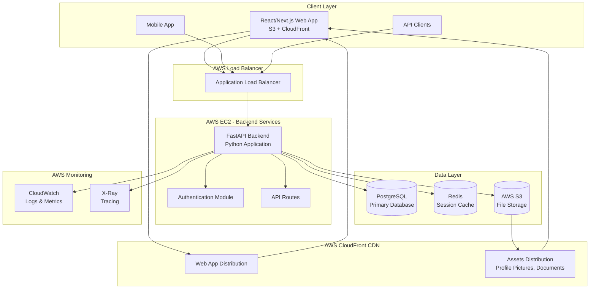
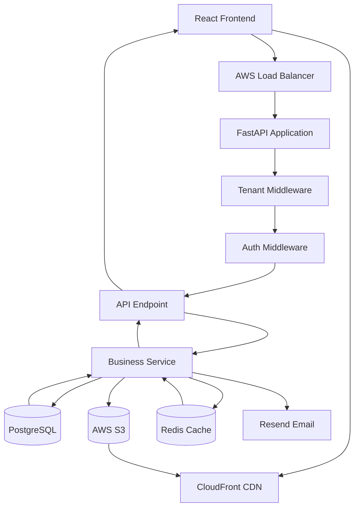

# Starline Backend - System Architecture Documentation

## Table of Contents
1. [Architecture Overview](#architecture-overview)
2. [Technology Stack](#technology-stack)
3. [System Components](#system-components)
4. [Application Architecture](#application-architecture)
5. [Database Architecture](#database-architecture)
6. [Security Architecture](#security-architecture)
7. [Infrastructure Architecture](#infrastructure-architecture)
8. [Deployment Architecture](#deployment-architecture)
9. [Monitoring & Observability](#monitoring--observability)
10. [Scalability Considerations](#scalability-considerations)
11. [Disaster Recovery](#disaster-recovery)
12. [White-Label Multi-Tenancy](#white-label-multi-tenancy)

## Architecture Overview

### System Design Principles
- **Monolithic Architecture**: Single deployable FastAPI application with modular structure
- **Domain-Driven Design**: Code organized around business domains
- **White-Label Multi-Tenancy**: Support for multiple organizations with branding
- **API-First Design**: RESTful APIs with comprehensive OpenAPI documentation
- **Security by Design**: HIPAA compliance and security integrated throughout
- **Scalability**: Designed for horizontal and vertical scaling

### High-Level Architecture Diagram


## Technology Stack

### Backend Technologies
- **Runtime**: Python 3.11+
- **Framework**: FastAPI with OpenAPI 3.0 specification
- **Language**: Python with type hints and Pydantic models
- **ASGI Server**: Uvicorn with Gunicorn for production
- **ORM**: SQLAlchemy 2.0 with async support
- **Migrations**: Alembic for database schema management
- **Email**: Resend for transactional emails
- **Real-time**: WebSockets with FastAPI (optional)

### Frontend Technologies
- **Framework**: React.js with Next.js (recommended)
- **Language**: TypeScript for type safety
- **Build Tool**: Vite or Next.js build system
- **State Management**: Zustand or Redux Toolkit
- **UI Components**: Tailwind CSS with Headless UI or shadcn/ui
- **API Client**: Generated TypeScript client from OpenAPI spec

### Database Technologies
- **Primary Database**: PostgreSQL 15+ with multi-tenant schema design
- **Connection Pool**: PgBouncer for connection management
- **Caching**: Redis 7+ (optional for session caching and rate limiting)
- **File Storage**: AWS S3 with bucket per tenant organization
- **CDN**: AWS CloudFront for global content delivery

### Infrastructure & DevOps
- **Compute**: AWS EC2 instances
- **Storage**: AWS S3 for files and static assets
- **CDN**: AWS CloudFront for content delivery
- **Load Balancing**: AWS Application Load Balancer
- **Monitoring**: AWS CloudWatch, AWS X-Ray
- **Logging**: AWS CloudWatch Logs

### Security & Compliance
- **Authentication**: JWT with HS256/RS256 signing and refresh tokens
- **2FA**: Time-based One-Time Password (TOTP) support
- **Authorization**: Fine-grained Role-Based Access Control (RBAC)
- **Encryption**: AES-256 for data at rest, TLS 1.3 for data in transit
- **Rate Limiting**: Redis-based rate limiting per user/organization
- **HIPAA Compliance**: PHI protection, audit logs, and access controls
- **Multi-Tenant Security**: Data isolation between organizations

## System Components

### FastAPI Monolithic Application

#### Core Application Responsibilities
**Core Features (11 Main Modules):**
1. **User Management & Authentication** - Multi-tenant user system with RBAC
2. **Client Management** - Comprehensive client profiles and care coordination
3. **Staff Management** - Employee management with certifications and training
4. **Health Records (EHR)** - Medical records, medications, and vital signs
5. **Service Management** - Service plans, goals, and progress tracking
6. **Scheduling & Calendar** - Staff scheduling and appointment management
7. **Billing & Financial** - Claims processing and payment tracking
8. **Documentation System** - Document templates and form submissions
9. **Reporting & Analytics** - Custom reports and dashboard analytics
10. **Communication & Notifications** - Multi-channel messaging system
11. **File Management** - Secure file storage and access control

**White-Label Multi-Tenancy:**
- Organization-based tenant isolation
- Custom branding per organization
- Configurable feature sets
- Separate data domains per tenant

**Application Structure:**
```python
app/
├── main.py                    # FastAPI application entry point
├── core/
│   ├── config.py             # Environment configuration
│   ├── security.py           # Authentication & JWT handling
│   ├── database.py           # Database connection & session
│   ├── exceptions.py         # Custom exception classes
│   ├── middleware.py         # Custom middleware (tenant, auth, etc.)
│   ├── aws.py                # AWS S3 and CloudFront integration
│   └── email.py              # Resend email service integration
├── models/                   # SQLAlchemy ORM models
│   ├── base.py              # Base model with tenant support
│   ├── user.py              # User and organization models
│   ├── client.py            # Client management models
│   ├── staff.py             # Staff and certification models
│   ├── health.py            # Health records models
│   ├── service.py           # Service and goal models
│   ├── scheduling.py        # Calendar and appointment models
│   ├── billing.py           # Billing and payment models
│   ├── document.py          # Document and form models
│   └── notification.py      # Communication models
├── schemas/                  # Pydantic request/response schemas
├── api/v1/                  # API version 1 endpoints
│   ├── auth.py             # Authentication endpoints
│   ├── users.py            # User management
│   ├── clients.py          # Client management
│   ├── staff.py            # Staff management
│   ├── health.py           # Health records
│   ├── services.py         # Service management
│   ├── scheduling.py       # Calendar & appointments
│   ├── billing.py          # Billing & financial
│   ├── documents.py        # Document management
│   ├── reports.py          # Reporting & analytics
│   ├── notifications.py    # Communications
│   └── files.py            # File management
├── services/               # Business logic layer
├── utils/                  # Utility functions
├── migrations/             # Alembic database migrations
└── tests/                  # Test suite
```

#### Frontend Application

**Technology Stack:**
- React.js / Next.js
- TypeScript for type safety
- Material-UI or Tailwind CSS for styling
- Redux Toolkit for state management
- Axios for API communication
- React Router for navigation

**Deployment:**
- Built static assets hosted on AWS S3
- Distributed via AWS CloudFront CDN
- Custom domain with SSL certificate
- Environment-specific configurations

**Key Features:**
- Responsive design for desktop and tablet
- Progressive Web App (PWA) capabilities
- Client-side routing with React Router
- Real-time updates via WebSocket connections
- Offline functionality for critical features
- Role-based UI rendering

#### File Storage & CDN

**AWS S3 Configuration:**
- **Profile Pictures**: User and client profile images
- **Documents**: Care plans, assessments, reports
- **Static Assets**: Frontend application files
- **Backups**: Database and application backups

**AWS CloudFront Integration:**
- **Global CDN**: Fast content delivery worldwide
- **Cache Optimization**: Optimized caching strategies
- **Security**: Origin access control and signed URLs
- **SSL/TLS**: HTTPS encryption for all content

**File Management Features:**
- Secure file upload with validation
- Image optimization and resizing
- Version control for documents
- Access control and permissions
- Virus scanning for uploaded files

## Application Architecture

### Monolithic Backend with Modular Design

#### FastAPI Application Structure
The backend follows a modular monolithic architecture with clear separation of concerns:

```python
# main.py - Application entry point
from fastapi import FastAPI
from fastapi.middleware.cors import CORSMiddleware
from fastapi.middleware.trustedhost import TrustedHostMiddleware
from contextlib import asynccontextmanager
import uvicorn

from core.config import settings
from core.database import create_tables, close_db_connection
from core.middleware import TenantMiddleware, AuthenticationMiddleware
from api.v1 import (
    auth, users, clients, staff, health, services, 
    scheduling, billing, documents, reports, notifications, files
)

@asynccontextmanager
async def lifespan(app: FastAPI):
    # Startup
    await create_tables()
    yield
    # Shutdown
    await close_db_connection()

app = FastAPI(
    title="Starline Backend API",
    description="White-label backend for domestic service providers",
    version="1.0.0",
    docs_url="/api/docs" if settings.ENVIRONMENT == "development" else None,
    redoc_url="/api/redoc" if settings.ENVIRONMENT == "development" else None,
    lifespan=lifespan
)

# Middleware configuration
app.add_middleware(
    CORSMiddleware,
    allow_origins=settings.ALLOWED_ORIGINS,
    allow_credentials=True,
    allow_methods=["GET", "POST", "PUT", "DELETE", "PATCH"],
    allow_headers=["*"],
)

app.add_middleware(TrustedHostMiddleware, allowed_hosts=settings.ALLOWED_HOSTS)
app.add_middleware(TenantMiddleware)  # Multi-tenant middleware
app.add_middleware(AuthenticationMiddleware)  # Auth middleware

# Health check endpoint
@app.get("/api/v1/health")
async def health_check():
    return {"status": "ok", "version": "1.0.0"}

# API Routes
app.include_router(auth.router, prefix="/api/v1/auth", tags=["Authentication"])
app.include_router(users.router, prefix="/api/v1/users", tags=["User Management"])
app.include_router(clients.router, prefix="/api/v1/clients", tags=["Client Management"])
app.include_router(staff.router, prefix="/api/v1/staff", tags=["Staff Management"])
app.include_router(health.router, prefix="/api/v1/health", tags=["Health Records"])
app.include_router(services.router, prefix="/api/v1/services", tags=["Service Management"])
app.include_router(scheduling.router, prefix="/api/v1/scheduling", tags=["Scheduling & Calendar"])
app.include_router(billing.router, prefix="/api/v1/billing", tags=["Billing & Financial"])
app.include_router(documents.router, prefix="/api/v1/documents", tags=["Documentation System"])
app.include_router(reports.router, prefix="/api/v1/reports", tags=["Reporting & Analytics"])
app.include_router(notifications.router, prefix="/api/v1/notifications", tags=["Communication & Notifications"])
app.include_router(files.router, prefix="/api/v1/files", tags=["File Management"])
```

#### Domain Module Organization
```python
#### Multi-Tenant Architecture
The application uses a **single-database, multi-tenant architecture** with tenant isolation:

```python
# Base model for all tenant-aware tables
class TenantMixin:
    organization_id: Mapped[uuid.UUID] = mapped_column(
        UUID(as_uuid=True), 
        ForeignKey("organizations.id"), 
        nullable=False,
        index=True
    )

# Example tenant-aware model
class Client(Base, TenantMixin, TimestampMixin):
    __tablename__ = "clients"
    
    id: Mapped[uuid.UUID] = mapped_column(UUID(as_uuid=True), primary_key=True)
    first_name: Mapped[str] = mapped_column(String(100), nullable=False)
    last_name: Mapped[str] = mapped_column(String(100), nullable=False)
    # ... other fields
    
    # Tenant isolation at model level
    __table_args__ = (
        Index('idx_clients_org_id', 'organization_id'),
    )

# Automatic tenant filtering
def get_current_tenant() -> uuid.UUID:
    """Get current tenant from request context"""
    return request_context.organization_id

class TenantQueryMixin:
    """Automatically filter queries by tenant"""
    @classmethod
    def query_for_tenant(cls, session: AsyncSession, tenant_id: uuid.UUID):
        return session.query(cls).filter(cls.organization_id == tenant_id)
```
```

### Request Processing Flow



#### Multi-Tenant Request Flow
1. **Request arrives** with organization context (subdomain or header)
2. **Tenant Middleware** identifies organization and sets context
3. **Auth Middleware** validates JWT token and user permissions
4. **Business Logic** automatically filters data by organization_id
5. **Response** contains only tenant-specific data

#### Authentication & Authorization Flow
- **JWT Access Tokens**: Short-lived (15 minutes) with user claims
- **Refresh Tokens**: Long-lived (30 days) for token renewal
- **Role-Based Access Control**: Fine-grained permissions per organization
- **2FA Support**: TOTP-based two-factor authentication
- **Password Security**: bcrypt hashing with salt

## Database Architecture

### Multi-Tenant Database Design
Single PostgreSQL database with tenant-aware table design:

```mermaid
graph TB
    subgraph "FastAPI Application"
        FASTAPI[FastAPI Backend]
        TENANT_MW[Tenant Middleware]
    end
    
    subgraph "PostgreSQL Database - Multi-Tenant"
        ORGS[Organizations Table]
        USERS[Users Table + org_id]
        CLIENTS[Clients Table + org_id]
        STAFF[Staff Table + org_id]
        HEALTH[Health Records + org_id]
        SERVICES[Services + org_id]
        SCHEDULE[Scheduling + org_id]
        BILLING[Billing + org_id]
        DOCS[Documents + org_id]
        AUDIT[Audit Logs + org_id]
    end
    
    subgraph "Per-Tenant S3 Storage"
        S3_ORG1[Tenant 1 Files]
        S3_ORG2[Tenant 2 Files]
        S3_ORG3[Tenant N Files]
    end
    
    subgraph "Shared Services"
        REDIS[(Redis Cache)]
        EMAIL[Resend Email]
    end
    
    subgraph "CDN"
        CLOUDFRONT[AWS CloudFront]
    end
    
    TENANT_MW --> ORGS
    FASTAPI --> USERS
    FASTAPI --> CLIENTS
    FASTAPI --> STAFF
    FASTAPI --> HEALTH
    FASTAPI --> SERVICES
    FASTAPI --> SCHEDULE
    FASTAPI --> BILLING
    FASTAPI --> DOCS
    FASTAPI --> AUDIT
    
    FASTAPI --> S3_ORG1
    FASTAPI --> S3_ORG2
    FASTAPI --> S3_ORG3
    
    FASTAPI --> REDIS
    FASTAPI --> EMAIL
    
    S3_ORG1 --> CLOUDFRONT
    S3_ORG2 --> CLOUDFRONT
    S3_ORG3 --> CLOUDFRONT
```



### Multi-Tenant Database Strategies

#### 1. Tenant Isolation
- **Row-Level Security**: PostgreSQL RLS policies per organization
- **Automatic Filtering**: All queries automatically include organization_id
- **Data Integrity**: Foreign key constraints respect tenant boundaries
- **Backup Strategy**: Tenant-aware backup and restore procedures

#### 2. Performance Optimization
- **Tenant-Aware Indexing**: Composite indexes with organization_id
- **Partitioning**: Table partitioning by organization for large datasets
- **Query Optimization**: Efficient tenant filtering at database level
- **Connection Pooling**: PgBouncer with tenant-aware connection routing

#### 3. Scaling Strategies
- **Vertical Scaling**: Increase instance size for growing tenant load
- **Read Replicas**: Read-only replicas for reporting and analytics
- **Tenant Sharding**: Future option to separate large tenants
- **Caching**: Redis caching with tenant-specific cache keys

## Security Architecture

### Security Layers

#### 1. Network Security
- **VPC**: Isolated AWS Virtual Private Cloud
- **Security Groups**: Restrictive firewall rules per service
- **WAF**: Web Application Firewall for API protection
- **DDoS Protection**: AWS Shield Advanced for protection
- **SSL/TLS**: End-to-end encryption with proper certificate management

#### 2. Application Security
- **JWT Security**: Secure token generation with proper key rotation
- **Multi-Tenant Security**: Tenant isolation at application and data level
- **Rate Limiting**: Per-user and per-tenant API rate limiting
- **Input Validation**: Pydantic models for comprehensive validation
- **SQL Injection Prevention**: SQLAlchemy ORM with parameterized queries
- **CSRF Protection**: Cross-site request forgery protection
- **Security Headers**: Comprehensive security headers implementation

#### 3. Data Security & HIPAA Compliance
- **Encryption at Rest**: AES-256 encryption for database and S3
- **Encryption in Transit**: TLS 1.3 for all API communications
- **Key Management**: AWS KMS for encryption key management
- **PHI Protection**: Healthcare data protection and anonymization
- **Audit Logging**: Comprehensive audit trails for all data access
- **Data Masking**: PII/PHI masking in logs and non-production environments
- **Backup Encryption**: Encrypted database and file backups

### Security Patterns

#### 1. Zero Trust Architecture
- **Identity Verification**: Every request authenticated
- **Least Privilege**: Minimal required permissions
- **Continuous Monitoring**: Real-time security assessment

#### 2. Defense in Depth
- **Multiple Security Layers**: Overlapping security controls
- **Fail-Safe Defaults**: Secure by default configurations
- **Security Monitoring**: Continuous threat detection

### Compliance Framework

#### HIPAA Compliance Implementation
- **Administrative Safeguards**: 
  - Written security policies and procedures
  - Designated security officer and team
  - User training and access management
  - Incident response procedures
- **Physical Safeguards**:
  - AWS data center physical security
  - Workstation and device access controls
  - Media controls and disposal procedures
- **Technical Safeguards**:
  - Unique user identification and authentication
  - Automatic session timeout and lockout
  - Encryption of PHI at rest and in transit
  - Audit controls and access logging
  - Data integrity controls and validation
- **Multi-Tenant HIPAA**: Tenant-specific BAAs and compliance controls

#### SOC 2 Type II Compliance
- **Security Criteria**:
  - Access controls and multi-factor authentication
  - Network security and intrusion detection
  - System monitoring and incident response
- **Availability Criteria**:
  - System uptime monitoring and SLA compliance
  - Disaster recovery and business continuity
  - Performance monitoring and capacity planning
- **Processing Integrity**:
  - Data validation and error handling
  - System processing controls and monitoring
  - Change management and version control
- **Confidentiality & Privacy**:
  - Data classification and handling procedures
  - Privacy controls for personal information
  - Data retention and disposal policies

## Infrastructure Architecture

### AWS Infrastructure Architecture

```mermaid
graph TB
    subgraph "AWS Cloud"
        subgraph "Global Services"
            CLOUDFRONT[CloudFront CDN]
            ROUTE53[Route 53 DNS]
        end
        
        subgraph "Region: us-east-1"
            subgraph "VPC"
                subgraph "Public Subnets"
                    ALB[Application Load Balancer]
                    NAT[NAT Gateway]
                end
                
                subgraph "Private Subnets"
                    EC2_APP[EC2 - FastAPI App]
                    EC2_DB[EC2 - PostgreSQL]
                    REDIS[ElastiCache Redis<br/>(Optional)]
                end
            end
            
            subgraph "Storage Services"
                S3_FILES[S3 - Files & Documents]
                S3_FRONTEND[S3 - Frontend Assets]
                S3_BACKUPS[S3 - Database Backups]
            end
            
            subgraph "Security & Monitoring"
                IAM[IAM Roles & Policies]
                KMS[KMS - Encryption Keys]
                CLOUDWATCH[CloudWatch]
                XRAY[X-Ray Tracing]
            end
        end
    end
    
    INTERNET[Internet Users] --> CLOUDFRONT
    CLOUDFRONT --> S3_FRONTEND
    CLOUDFRONT --> S3_FILES
    
    INTERNET --> ALB
    ALB --> EC2_APP
    EC2_APP --> EC2_DB
    EC2_APP --> REDIS
    EC2_APP --> S3_FILES
    
    EC2_APP --> CLOUDWATCH
    EC2_APP --> XRAY
```

### EC2 Instance Configuration

#### Production Environment
```yaml
# EC2 Instance Specifications
Instance Type: t3.large (2 vCPUs, 8 GB RAM)
Operating System: Ubuntu 22.04 LTS
Storage: 
  - Root Volume: 50 GB gp3 SSD
  - Data Volume: 100 GB gp3 SSD (for PostgreSQL)
  - Backup Volume: 200 GB gp3 SSD (for backups)

Security Groups:
  - Web Traffic: Port 80, 443 (from ALB only)
  - SSH Access: Port 22 (from admin IPs only)
  - Database: Port 5432 (internal only)
  - Application: Port 8000 (from ALB only)
```

#### Application Deployment
```bash
# FastAPI Application Setup
# /opt/starline/app/
├── app/                    # FastAPI application code
├── requirements.txt        # Python dependencies
├── gunicorn.conf.py       # Gunicorn configuration
├── supervisord.conf       # Process management
└── nginx.conf             # Nginx reverse proxy

# Service Management with Supervisor
[program:starline-api]
command=/opt/starline/venv/bin/gunicorn -c gunicorn.conf.py app.main:app
directory=/opt/starline/app
user=starline
autostart=true
autorestart=true
stdout_logfile=/var/log/starline/api.log
stderr_logfile=/var/log/starline/api_error.log

[program:nginx]
command=/usr/sbin/nginx -g 'daemon off;'
autostart=true
autorestart=true
```

#### Database Configuration
```yaml
# PostgreSQL on EC2
Instance Type: t3.medium (2 vCPUs, 4 GB RAM)
Storage: 200 GB gp3 SSD with encryption
Backup Strategy:
  - Daily automated backups to S3
  - Point-in-time recovery capability
  - Cross-region backup replication

Configuration:
  - max_connections: 200
  - shared_buffers: 1GB
  - effective_cache_size: 3GB
  - maintenance_work_mem: 256MB
  - checkpoint_completion_target: 0.9
```

## Deployment Architecture

### CI/CD Pipeline

#### 1. Source Code Management
- **Git Workflow**: GitFlow with feature branches
- **Code Review**: Pull request reviews required
- **Automated Testing**: Unit, integration, and security tests

#### 2. Build Pipeline
```yaml
# .github/workflows/build.yml
name: Build and Test
on:
  pull_request:
    branches: [main, develop]
  push:
    branches: [main, develop]

jobs:
  test:
    runs-on: ubuntu-latest
    steps:
      - uses: actions/checkout@v3
      - name: Setup Node.js
        uses: actions/setup-node@v3
        with:
          node-version: '18'
      - name: Install dependencies
        run: npm ci
      - name: Run tests
        run: npm test
      - name: Run security scan
        run: npm audit
      - name: Build application
        run: npm run build
```

#### 3. Deployment Pipeline
```yaml
# .github/workflows/deploy.yml
name: Deploy to Production
on:
  push:
    branches: [main]

jobs:
  deploy:
    runs-on: ubuntu-latest
    steps:
      - uses: actions/checkout@v3
      - name: Build Docker image
        run: docker build -t starline/user-service:${{ github.sha }} .
      - name: Push to registry
        run: docker push starline/user-service:${{ github.sha }}
      - name: Deploy to Kubernetes
        run: |
          kubectl set image deployment/user-service \
            user-service=starline/user-service:${{ github.sha }}
```

### Environment Strategy

#### 1. Development Environment
- **Infrastructure**: Local development with Docker Compose
- **Database**: PostgreSQL container with test data
- **File Storage**: Local file system or MinIO container
- **Frontend**: Local development server (npm run dev)
- **Backend**: Local FastAPI with hot reload

#### 2. Staging Environment
- **Infrastructure**: Single EC2 t3.medium instance
- **Database**: PostgreSQL on the same instance
- **File Storage**: S3 bucket (starline-staging-files)
- **Frontend**: S3 + CloudFront distribution
- **Domain**: staging.starline.com

#### 3. Production Environment
- **Infrastructure**: 
  - EC2 t3.large for FastAPI application
  - EC2 t3.medium for PostgreSQL database
  - Application Load Balancer for high availability
- **File Storage**: S3 bucket (starline-prod-files)
- **Frontend**: S3 + CloudFront distribution
- **Domain**: app.starline.com
- **Monitoring**: CloudWatch, X-Ray, SNS alerts

### Deployment Strategy

#### Rolling Deployment with Health Checks
```bash
#!/bin/bash
# Deployment script for EC2

# 1. Backup current application
sudo cp -r /opt/starline/app /opt/starline/app.backup.$(date +%Y%m%d_%H%M%S)

# 2. Stop application services
sudo supervisorctl stop starline-api

# 3. Update application code
cd /opt/starline/app
git pull origin main

# 4. Update dependencies
source /opt/starline/venv/bin/activate
pip install -r requirements.txt

# 5. Run database migrations
alembic upgrade head

# 6. Start application services
sudo supervisorctl start starline-api

# 7. Health check
sleep 10
curl -f http://localhost:8000/api/v1/health || {
    echo "Health check failed, rolling back..."
    sudo supervisorctl stop starline-api
    sudo rm -rf /opt/starline/app
    sudo mv /opt/starline/app.backup.* /opt/starline/app
    sudo supervisorctl start starline-api
    exit 1
}

echo "Deployment successful!"
```

#### Frontend Deployment to S3
```bash
#!/bin/bash
# Frontend deployment script

# 1. Build the application
npm run build

# 2. Sync to S3 with cache headers
aws s3 sync dist/ s3://starline-prod-frontend/ \
  --delete \
  --cache-control "max-age=31536000" \
  --exclude "*.html" \
  --exclude "service-worker.js"

# 3. Upload HTML files with no-cache
aws s3 sync dist/ s3://starline-prod-frontend/ \
  --cache-control "no-cache" \
  --include "*.html" \
  --include "service-worker.js"

# 4. Invalidate CloudFront cache
aws cloudfront create-invalidation \
  --distribution-id E1234567890123 \
  --paths "/*"
```

## Monitoring & Observability

### Monitoring Stack

#### 1. AWS CloudWatch Monitoring
```python
# CloudWatch custom metrics in FastAPI
import boto3
from datetime import datetime

cloudwatch = boto3.client('cloudwatch')

def log_custom_metric(metric_name: str, value: float, unit: str = 'Count'):
    """Log custom application metrics to CloudWatch"""
    cloudwatch.put_metric_data(
        Namespace='Starline/Application',
        MetricData=[
            {
                'MetricName': metric_name,
                'Value': value,
                'Unit': unit,
                'Timestamp': datetime.utcnow()
            }
        ]
    )

# Usage in FastAPI endpoints
@app.middleware("http")
async def metrics_middleware(request: Request, call_next):
    start_time = time.time()
    response = await call_next(request)
    process_time = time.time() - start_time
    
    # Log response time
    log_custom_metric('ResponseTime', process_time * 1000, 'Milliseconds')
    
    # Log request count
    log_custom_metric('RequestCount', 1, 'Count')
    
    if response.status_code >= 400:
        log_custom_metric('ErrorCount', 1, 'Count')
    
    return response
```

#### 2. Infrastructure Monitoring
- **CloudWatch Agent**: EC2 system metrics and custom logs
- **EC2 Detailed Monitoring**: CPU, memory, disk, network metrics
- **RDS Performance Insights**: Database performance monitoring
- **S3 Request Metrics**: File storage access patterns

#### 3. Application Logging
```python
# Structured logging configuration
import logging
import json
from datetime import datetime

class CloudWatchFormatter(logging.Formatter):
    def format(self, record):
        log_entry = {
            'timestamp': datetime.utcnow().isoformat(),
            'level': record.levelname,
            'message': record.getMessage(),
            'module': record.module,
            'function': record.funcName,
            'line': record.lineno
        }
        
        if hasattr(record, 'user_id'):
            log_entry['user_id'] = record.user_id
        if hasattr(record, 'client_id'):
            log_entry['client_id'] = record.client_id
            
        return json.dumps(log_entry)

# Configure logging
logging.basicConfig(
    level=logging.INFO,
    format='%(message)s',
    handlers=[
        logging.StreamHandler(),
        logging.FileHandler('/var/log/starline/app.log')
    ]
)

logger = logging.getLogger(__name__)
logger.setLevel(logging.INFO)
for handler in logger.handlers:
    handler.setFormatter(CloudWatchFormatter())
```

### CloudWatch Alarms

#### Critical Alerts
```bash
# High Error Rate Alarm
aws cloudwatch put-metric-alarm \
  --alarm-name "Starline-HighErrorRate" \
  --alarm-description "High HTTP error rate detected" \
  --metric-name ErrorCount \
  --namespace Starline/Application \
  --statistic Sum \
  --period 300 \
  --threshold 10 \
  --comparison-operator GreaterThanThreshold \
  --evaluation-periods 2 \
  --alarm-actions arn:aws:sns:us-east-1:123456789012:starline-alerts

# Database Connection Alarm
aws cloudwatch put-metric-alarm \
  --alarm-name "Starline-DatabaseDown" \
  --alarm-description "Database connection failure" \
  --metric-name DatabaseConnectionFailure \
  --namespace Starline/Application \
  --statistic Sum \
  --period 60 \
  --threshold 1 \
  --comparison-operator GreaterThanOrEqualToThreshold \
  --evaluation-periods 1 \
  --alarm-actions arn:aws:sns:us-east-1:123456789012:starline-critical

# High CPU Usage Alarm
aws cloudwatch put-metric-alarm \
  --alarm-name "Starline-HighCPU" \
  --alarm-description "High CPU utilization" \
  --metric-name CPUUtilization \
  --namespace AWS/EC2 \
  --statistic Average \
  --period 300 \
  --threshold 80 \
  --comparison-operator GreaterThanThreshold \
  --evaluation-periods 3
```

### AWS X-Ray Tracing

#### Tracing Configuration
```python
# X-Ray integration in FastAPI
from aws_xray_sdk.core import xray_recorder
from aws_xray_sdk.core import patch_all
from aws_xray_sdk.fastapi import XRayMiddleware

# Patch AWS services for automatic tracing
patch_all()

app = FastAPI()

# Add X-Ray middleware
app.add_middleware(XRayMiddleware, recorder=xray_recorder)

# Configure X-Ray recorder
xray_recorder.configure(
    context_missing='LOG_ERROR',
    plugins=('EC2Plugin', 'PostgreSQLPlugin'),
    daemon_address='127.0.0.1:2000',
    use_ssl=False
)

@app.get("/api/v1/clients")
@xray_recorder.capture('get_clients')
async def get_clients():
    # Function will be automatically traced
    with xray_recorder.in_subsegment('database_query'):
        clients = await client_service.get_all_clients()
    return clients
```

## Scalability Considerations

### Horizontal Scaling

#### 1. EC2 Auto Scaling Group
```bash
# Auto Scaling Group Configuration
aws autoscaling create-auto-scaling-group \
  --auto-scaling-group-name starline-backend-asg \
  --launch-template LaunchTemplateName=starline-backend-lt,Version='$Latest' \
  --min-size 1 \
  --max-size 5 \
  --desired-capacity 2 \
  --target-group-arns arn:aws:elasticloadbalancing:us-east-1:123456789012:targetgroup/starline-backend/1234567890123456 \
  --health-check-type ELB \
  --health-check-grace-period 300

# Scaling Policies
aws autoscaling put-scaling-policy \
  --auto-scaling-group-name starline-backend-asg \
  --policy-name starline-scale-up \
  --scaling-adjustment 1 \
  --adjustment-type ChangeInCapacity \
  --cooldown 300

# CloudWatch Alarms for Auto Scaling
aws cloudwatch put-metric-alarm \
  --alarm-name starline-cpu-high \
  --alarm-description "Scale up when CPU > 70%" \
  --metric-name CPUUtilization \
  --namespace AWS/EC2 \
  --statistic Average \
  --period 300 \
  --threshold 70 \
  --comparison-operator GreaterThanThreshold \
  --evaluation-periods 2
```

#### 2. Database Scaling Strategies
- **Connection Pooling**: PgBouncer for connection management
- **Read Replicas**: PostgreSQL streaming replication
- **Query Optimization**: Proper indexing and query tuning
- **Caching**: Redis for session and frequently accessed data

#### 3. Application Load Balancer Configuration
```bash
# Create Application Load Balancer
aws elbv2 create-load-balancer \
  --name starline-alb \
  --subnets subnet-12345678 subnet-87654321 \
  --security-groups sg-903004f8 \
  --scheme internet-facing \
  --type application

# Health Check Configuration
aws elbv2 create-target-group \
  --name starline-backend-tg \
  --protocol HTTP \
  --port 8000 \
  --vpc-id vpc-12345678 \
  --health-check-path /api/v1/health \
  --health-check-interval-seconds 30 \
  --health-check-timeout-seconds 5 \
  --healthy-threshold-count 2 \
  --unhealthy-threshold-count 3
```

### Vertical Scaling

#### Instance Type Progression
```bash
# Development: t3.small (2 vCPUs, 2 GB RAM)
# Staging: t3.medium (2 vCPUs, 4 GB RAM)
# Production (Low): t3.large (2 vCPUs, 8 GB RAM)
# Production (Medium): t3.xlarge (4 vCPUs, 16 GB RAM)
# Production (High): c5.2xlarge (8 vCPUs, 16 GB RAM)

# Automated instance resizing script
#!/bin/bash
INSTANCE_ID="i-1234567890abcdef0"
NEW_INSTANCE_TYPE="t3.xlarge"

# Stop instance
aws ec2 stop-instances --instance-ids $INSTANCE_ID
aws ec2 wait instance-stopped --instance-ids $INSTANCE_ID

# Modify instance type
aws ec2 modify-instance-attribute \
  --instance-id $INSTANCE_ID \
  --instance-type Value=$NEW_INSTANCE_TYPE

# Start instance
aws ec2 start-instances --instance-ids $INSTANCE_ID
```

### Performance Targets
- **Response Time**: 95th percentile < 500ms
- **Throughput**: 10,000 requests per second
- **Availability**: 99.9% uptime
- **Recovery Time**: < 5 minutes for service restoration

## Disaster Recovery

### Backup Strategy

#### 1. Database Backups
```bash
#!/bin/bash
# Daily backup script
pg_dump -h $DB_HOST -U $DB_USER -d starline_prod | \
gzip > /backups/starline_$(date +%Y%m%d).sql.gz

# Upload to S3
aws s3 cp /backups/starline_$(date +%Y%m%d).sql.gz \
s3://starline-backups/database/
```

#### 2. File Storage Backups
- **Cross-Region Replication**: S3 cross-region replication
- **Version Control**: S3 versioning enabled
- **Lifecycle Policies**: Automated backup retention

### Recovery Procedures

#### 1. Service Recovery
```yaml
# Service restoration playbook
- name: Restore service from backup
  tasks:
    - name: Scale down current deployment
      kubernetes.core.k8s_scale:
        api_version: apps/v1
        kind: Deployment
        name: "{{ service_name }}"
        namespace: "{{ namespace }}"
        replicas: 0
    
    - name: Restore database
      shell: |
        psql -h {{ db_host }} -U {{ db_user }} -d {{ db_name }} < {{ backup_file }}
    
    - name: Scale up deployment
      kubernetes.core.k8s_scale:
        api_version: apps/v1
        kind: Deployment
        name: "{{ service_name }}"
        namespace: "{{ namespace }}"
        replicas: "{{ replica_count }}"
```

#### 2. Full System Recovery
- **RTO (Recovery Time Objective)**: 4 hours
- **RPO (Recovery Point Objective)**: 1 hour
- **Disaster Declaration**: Clear escalation procedures
- **Communication Plan**: Stakeholder notification process

## White-Label Multi-Tenancy

### Multi-Tenant Architecture Overview
Starline implements a **single-application, multi-tenant architecture** that supports multiple organizations with complete data isolation and custom branding.

#### Tenant Identification Methods
```python
# 1. Subdomain-based tenant identification
# client1.starline.com -> organization: client1
# client2.starline.com -> organization: client2

# 2. Header-based tenant identification
# X-Organization-ID: uuid-of-organization

# 3. JWT token-based identification
# JWT contains organization_id claim

class TenantMiddleware:
    async def __call__(self, request: Request, call_next):
        # Extract tenant from subdomain
        host = request.headers.get("host", "")
        subdomain = host.split(".")[0]
        
        # Or from header
        org_header = request.headers.get("X-Organization-ID")
        
        # Set tenant context
        request.state.organization_id = await resolve_tenant(
            subdomain=subdomain, 
            header=org_header
        )
        
        response = await call_next(request)
        return response
```

#### Data Isolation Strategy
```sql
-- All tenant-aware tables include organization_id
CREATE TABLE clients (
    id UUID PRIMARY KEY,
    organization_id UUID NOT NULL REFERENCES organizations(id),
    first_name VARCHAR(100) NOT NULL,
    last_name VARCHAR(100) NOT NULL,
    -- other fields...
    created_at TIMESTAMP DEFAULT NOW(),
    updated_at TIMESTAMP DEFAULT NOW()
);

-- Composite indexes for performance
CREATE INDEX idx_clients_org_id ON clients(organization_id);
CREATE INDEX idx_clients_org_name ON clients(organization_id, last_name, first_name);

-- Row-Level Security (RLS) policies
ALTER TABLE clients ENABLE ROW LEVEL SECURITY;
CREATE POLICY clients_tenant_isolation ON clients
    FOR ALL TO application_user
    USING (organization_id = current_setting('app.current_organization_id')::UUID);
```

#### White-Label Branding
```python
# Organization branding configuration
class OrganizationSettings(BaseModel):
    organization_id: UUID
    
    # Branding
    organization_name: str
    logo_url: Optional[str] = None
    primary_color: str = "#3B82F6"  # Default blue
    secondary_color: str = "#EF4444"  # Default red
    favicon_url: Optional[str] = None
    
    # Custom domain
    custom_domain: Optional[str] = None  # e.g., "app.clientname.com"
    
    # Feature toggles
    features_enabled: Dict[str, bool] = {
        "health_records": True,
        "billing": True,
        "advanced_reporting": False,
        "api_access": True,
    }
    
    # Email branding
    email_from_name: str
    email_from_address: str
    email_reply_to: Optional[str] = None
    
    # Timezone and locale
    timezone: str = "UTC"
    locale: str = "en_US"
    date_format: str = "MM/DD/YYYY"
    currency: str = "USD"

# API endpoint to get organization settings
@router.get("/organization/settings")
async def get_organization_settings(
    current_user: User = Depends(get_current_user),
    db: AsyncSession = Depends(get_db)
) -> OrganizationSettings:
    org_id = current_user.organization_id
    settings = await get_organization_settings_by_id(db, org_id)
    return settings
```

#### Tenant-Aware File Storage
```python
# S3 bucket organization per tenant
class S3FileService:
    def __init__(self):
        self.s3_client = boto3.client('s3')
        self.base_bucket = settings.AWS_S3_BUCKET
    
    def get_tenant_prefix(self, organization_id: UUID) -> str:
        """Generate S3 prefix for tenant files"""
        return f"organizations/{organization_id}"
    
    async def upload_file(
        self, 
        file: UploadFile, 
        organization_id: UUID,
        file_type: str = "documents"
    ) -> str:
        """Upload file with tenant isolation"""
        prefix = self.get_tenant_prefix(organization_id)
        key = f"{prefix}/{file_type}/{uuid4()}/{file.filename}"
        
        # Upload to S3
        await self.s3_client.upload_fileobj(
            file.file,
            self.base_bucket,
            key,
            ExtraArgs={
                'ServerSideEncryption': 'AES256',
                'Metadata': {
                    'organization_id': str(organization_id),
                    'uploaded_by': str(current_user.id)
                }
            }
        )
        
        return f"https://cdn.starline.com/{key}"
    
    async def delete_tenant_data(self, organization_id: UUID):
        """Delete all files for a tenant (GDPR compliance)"""
        prefix = self.get_tenant_prefix(organization_id)
        
        # List and delete all objects with the tenant prefix
        objects = await self.s3_client.list_objects_v2(
            Bucket=self.base_bucket,
            Prefix=prefix
        )
        
        if 'Contents' in objects:
            delete_keys = [{'Key': obj['Key']} for obj in objects['Contents']]
            await self.s3_client.delete_objects(
                Bucket=self.base_bucket,
                Delete={'Objects': delete_keys}
            )
```

#### Multi-Tenant Database Operations
```python
# Automatic tenant filtering in service layer
class BaseService:
    def __init__(self, db: AsyncSession, organization_id: UUID):
        self.db = db
        self.organization_id = organization_id
    
    def get_base_query(self, model_class):
        """Base query with automatic tenant filtering"""
        return select(model_class).where(
            model_class.organization_id == self.organization_id
        )

class ClientService(BaseService):
    async def get_clients(
        self, 
        page: int = 1, 
        limit: int = 20,
        search: Optional[str] = None
    ) -> List[Client]:
        """Get clients for current tenant only"""
        query = self.get_base_query(Client)
        
        if search:
            query = query.where(
                or_(
                    Client.first_name.ilike(f"%{search}%"),
                    Client.last_name.ilike(f"%{search}%")
                )
            )
        
        query = query.offset((page - 1) * limit).limit(limit)
        result = await self.db.execute(query)
        return result.scalars().all()
    
    async def create_client(self, client_data: ClientCreate) -> Client:
        """Create client with automatic tenant assignment"""
        client = Client(
            **client_data.dict(),
            organization_id=self.organization_id  # Automatic tenant assignment
        )
        self.db.add(client)
        await self.db.commit()
        await self.db.refresh(client)
        return client
```

#### Tenant Onboarding Process
```python
# Organization setup API
@router.post("/organizations/setup")
async def setup_organization(
    setup_data: OrganizationSetup,
    db: AsyncSession = Depends(get_db)
) -> OrganizationSetupResponse:
    """Complete tenant onboarding process"""
    
    # 1. Create organization
    organization = Organization(
        name=setup_data.organization_name,
        domain=setup_data.domain,
        subscription_tier=setup_data.subscription_tier
    )
    db.add(organization)
    await db.flush()
    
    # 2. Create admin user
    admin_user = User(
        email=setup_data.admin_email,
        first_name=setup_data.admin_first_name,
        last_name=setup_data.admin_last_name,
        organization_id=organization.id,
        role=UserRole.ADMIN,
        is_active=True
    )
    admin_user.set_password(setup_data.admin_password)
    db.add(admin_user)
    
    # 3. Create default settings
    org_settings = OrganizationSettings(
        organization_id=organization.id,
        **setup_data.branding_settings
    )
    db.add(org_settings)
    
    # 4. Set up S3 folders
    await setup_tenant_storage(organization.id)
    
    # 5. Send welcome email
    await send_organization_welcome_email(
        organization.name,
        admin_user.email,
        setup_data.domain
    )
    
    await db.commit()
    
    return OrganizationSetupResponse(
        organization_id=organization.id,
        admin_user_id=admin_user.id,
        setup_complete=True,
        login_url=f"https://{setup_data.domain}.starline.com/login"
    )
```

### Multi-Tenant Security Considerations

#### Tenant Data Isolation
- **Database Level**: All queries automatically filtered by organization_id
- **Application Level**: Middleware enforces tenant context
- **File Storage**: S3 prefixes separate tenant files
- **Caching**: Redis keys include tenant identifier
- **Logs**: All logs include tenant context for debugging

#### Cross-Tenant Attack Prevention
- **Parameter Tampering**: All IDs validated against current tenant
- **Authorization Bypass**: Fine-grained permissions per tenant
- **Data Leakage**: Comprehensive audit logging
- **Subdomain Takeover**: Proper DNS configuration and validation

This comprehensive multi-tenant architecture provides complete data isolation, custom branding, and scalable white-label capabilities while maintaining security and performance standards. 